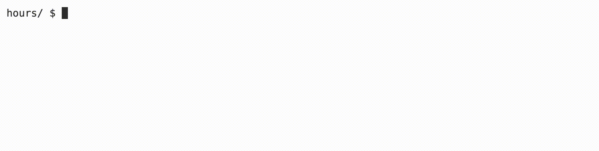
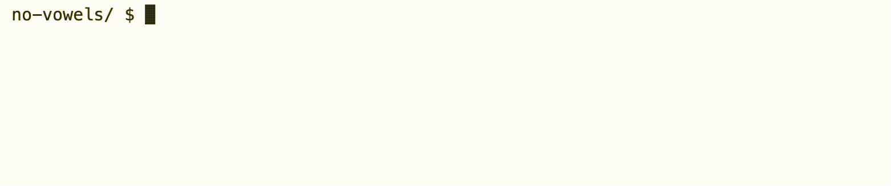

# Week 1 Exercises

Exercises designed by CS50 staff for the section of [week 2 of CS50](https://cs50.harvard.edu/college/2020/fall/weeks/2).

Exercises can be completed using [code.cs50.io](https://code.cs50.io).


## Hours 

### Learning Goals
1. Practice using arrays 
2. Using an array as a parameter of a function 
3. Adding values in a loop 
4. Integer Division and Type Casting 

### Background 
Suppose you’re taking CS50 (if you’re reading this you probably are!) and spending time every week on each problem set. You may be wondering how many hours you’ve spent learning computer science, 
on average or in total! In this program, you’ll complete a function that 
calculates, based on a user’s input, a total number of hours or an average 
number of hours across a given number of days.

### Demo 


### Getting Started 
1. Log into code.cs50.io using your GitHub account.
2. Click inside the terminal window and execute ```cd```.
3. At the ```$``` prompt, type ```mkdir hours```
4. ```cd hours``` 
5. Then copy and paste wget https://cdn.cs50.net/2022/fall/labs/2/hours.c into your terminal to download this lab’s distribution code.
6. You are to complete the function, ```calc_hours```, which calculates both total hours and average hours, depending on the value of ```output```.

### Implementation Details 
The ```main``` function prompts the user for the number of weeks a user has been taking CS50, 
then creates an array with as many elements. Notice that, after retrieving some data, 
the program prompts the user to type in either “T” or “A”—”T” should (but doesn’t yet!) print the total 
number of hours the user entered, while “A” should (but doesn’t yet!) print the average hours the user entered. 
Notice that the ```do while``` loop uses ```toupper``` to capitalize the letter that’s input 
before it is saved in the variable ```output```. Then, the ```printf``` function calls 
```calc_hours```. Note the syntax involved when passing an array to a function.

To complete ```calc_hours```, first total up the hours saved in the array into a new variable. Then, depending on the value of ```output```, return either this sum, or the average number of hours.


### Thought Question 
What is the advantage of using a function to calculate hours?

### How to Test Your Code 

```
hours/ $ ./hours
Number of weeks taking CS50: 3
Week 0 HW Hours: 3
Week 1 HW Hours: 7
Week 2 HW Hours: 10
Enter T for total hours, A for average hours per week: A
6.7 hours
```

```
hours/ $ ./hours
Number of weeks taking CS50: 2
Week 0 HW Hours: 2
Week 1 HW Hours: 8
Enter T for total hours, A for average hours per week: T
10.0 hours
```

You can check your code using ```check50```, a program that CS50 will use to test your code when you submit, by typing in the following at the $ prompt. But be sure to test it yourself as well!
```check50 cs50/labs/2022/fall/hours```

To evaluate that the style of your code, type in the following at the ```$``` prompt.
```style50 hours.c```

### How to Submit 
No need to submit. This is just an optional practice problem completed with your lab! 


## N0 V0w3ls

### Learning Goals 
1. Practice using strings
2. Practice using command-line arguments
3. Write a program entirely from scratch


### Background 
If you’ve been on the internet, you might have seen [“leetspeak”](https://en.wikipedia.org/wiki/Leet) (or “l33tsp36k” for our purposes!), which 
involves the substitution of symbols for alphabetical characters, where 
those symbols somewhat resemble their alphabetical counterparts. In this 
lab, you’ll write a program to replace certain vowels with digits!

Up until now, you’ve frequently written programs for which you’ve been provided 
distribution code. You’ll notice when downloading the “distro” for this problem, 
you start with nothing more than a couple of commonly used libraries and an empty 
```main``` function. In this problem, you will convert a word, which you will input at 
the command line, to a corresponding word with numbers replacing vowels.

### Demo 
 

### Getting Started 
1. Log into code.cs50.io using your GitHub account.
2. Click inside the terminal window and execute ```cd```.
3. At the ```$``` prompt, type ```mkdir no-vowels```
4. Now execute ```cd no-vowels```
5. Then copy and paste wget https://cdn.cs50.net/2022/fall/labs/2/no-vowels.c into your terminal to download this lab’s distribution code.

### Implementation Details 

- Implement your program in a file called ```no-vowels.c``` in a directory called ```no-vowels```.
- Your program must accept a single command-line argument, which will be the word that you want to convert.
- If your program is executed without any command-line arguments or with more than one command-line argument, your program should print an error message of your choice (with ```printf```) and ```return``` from ```main``` a value of 1 (which tends to signify an error) immediately.
- Your program must contain a function called ```replace``` which takes a string input and returns a string output.
- This function will change the following vowels to numbers: ```a``` becomes```6```, ```e``` becomes ```3```, ```i``` becomes ```1```, ```o``` becomes ```0``` and ```u``` does not change.
- The input parameter for the ```replace``` function will be ```argv[1]``` and the return value is the converted word.
- The ```main``` function will then print the converted word, followed by ```\n```.
- You may want to try using the ```switch``` statement in your ```replace``` function. Here is a link to some documentation: https://cs50.readthedocs.io/style/c/#switches. 

### Thought Question 
Why might you want to use command-line arguments rather than ```get_string```, ```get_int```, etc?

### How to Test Your Code 
Your program should behave per the examples below.

```
no-vowels/ $ ./no-vowels
Usage: ./no-vowels word
```

```
no-vowels/ $ ./no-vowels hello
h3ll0
```

```
no-vowels/ $ ./no-vowels pseudocode
ps3ud0c0d3
```

You can check your code using ```check50```, a program that CS50 will use to test your code when you submit, 
by typing in the following at the $ prompt. But be sure to test it yourself as well!

```check50 cs50/labs/2022/fall/no-vowels```

Green smilies mean your program has passed a test! Red frownies will indicate your program output something unexpected. 
Visit the URL that check50 outputs to see the input check50 handed to your program, what output it expected, 
and what output your program actually gave.

To evaluate that the style of your code (indentations and spacing) is correct, type in the following at the ```$``` prompt.
```
style50 no-vowels.c
```

### How to Submit 
Again, no need to submit this one! 
