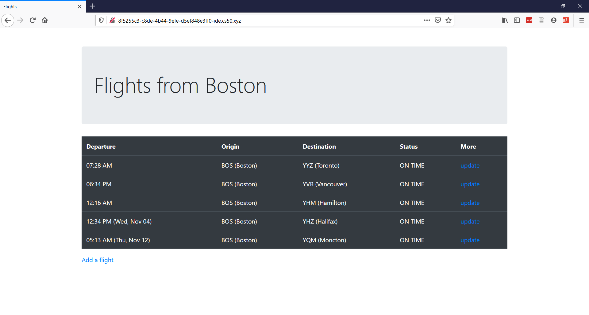

# Week 9 Exercises

Exercises designed by Josh Archibald for the section of [week 9 of CS50](https://cs50.harvard.edu/college/2020/fall/weeks/9).

Exercises can be completed using the CS50 IDE.


## Flights

On Election Night 2016, Canada's immigration website [crashed](https://www.theguardian.com/world/2016/nov/09/canadas-immigration-website-crashes-as-donald-trumps-us-election-lead-grows) and immigration applications to Canada subsequently [increased](https://www.ctvnews.ca/world/america-votes/i-m-not-comfortable-living-here-more-americans-did-actually-try-to-move-to-canada-since-trump-s-2016-election-1.5064819). In that spirit, today we will be creating a website with Flask and Jinja to view (fictional) flights from Boston to Canada, much like the tables you would see on screens in the airport.



For this exercise, you should have been divided into one of three groups. Each group will be doing a slightly different task to get practice with Flask and Jinja -- the sum of those parts will become the final product. If you finish your part early, go on to another!


### Getting started

To get started with the distro code, run these commands in your CS50 IDE terminal:

```
wget https://raw.githubusercontent.com/jsarchibald/cs50/2020/fall/exercises/distro/flights.zip
unzip flights.zip
cd flights
```


### Background

In the project folder, you're given `application.py`, which is where all the Python you'll be writing should go. It's the main Flask application file.

There's also `data.py`, which provides some data used in the problem (like a dictionary mapping airport codes to city names), and `helpers.py`, which provides a function to turn a [Unix timestamp](https://en.wikipedia.org/wiki/Unix_time) into a human-readable representation and a function to insert a flight into the database. You don't need to worry about the implementation of any of this. But, the function to turn a Unix timestamp into something readable is accessible as a Jinja filter. Just use something like: `{{ variable_name|to_timestamp }}`.

In `flights.db`, we have one table, `flights`, created like this:

```sql
CREATE TABLE flights (
    id INTEGER PRIMARY KEY,
    origin TEXT NOT NULL, /* origin airport code */
    destination TEXT NOT NULL, /* destination airport code */
    status TEXT NOT NULL, /* current flight status */
    departure INTEGER NOT NULL /* departure time, as a Unix timestamp */
);
```

In the `templates` folder, we are given `add.html`, which is where the form to add a flight lives; `index.html`, where the table showing flights is; `layout.html`, which specifies a reusable layout that is shared among the other templates; and `update.html`, which contains the form with which a flight status can be updated.


### Group 1: Index page

This is the group that will make the homepage table with flight statuses.


#### `application.py`

Let's take note of what the distribution code already does for you. In `application.py`, under the `index()` function, we get a listing of all the flights that depart after the current time, ordered by earliest departure time.

Your first `TODO` says:

```python
# TODO: return the index.html template, passing in AIRPORTS and flights
```

We should modify the following line to use [`render_template`](https://flask.palletsprojects.com/en/1.1.x/api/#flask.render_template), which should use `index.html` and pass in `airports=AIRPORTS, flights=flights`. The former, `AIRPORTS`, is a dictionary mapping airport codes (e.g., `BOS`) to city names (e.g., `Boston`). The latter is, of course, the list of flights we just selected from the database.

#### `templates/index.html`

Now let's look at `templates/index.html`, the Jinja template for the homepage. We see on line 13 a comment that `This column should link to /update/<flight_id>` -- okay, we can come back to that.

Our only `TODO` in this file is to `Loop through the flights, adding a row for each.`. Remember that thanks to `render_template`, we're given a list of flights we can access as `flights` in our Jinja template. That is, there's now a variable in our Jinja template called `flights`, which is a list of flights we can loop through.

Recall that in Jinja you can loop through items in a list like this:

```html

<!-- do something -->

```

Also recall that you can use variables in your HTML template like this:

```html
{{ variable_name }}
```

It may be helpful to think of how, in HTML, you would represent just one row of the table. Hard-code a row with some data. Then, imagine that you have a dictionary with all the fields you need to fill in -- `flight["origin"]`, `flight["destination"]`, `flight["departure"]`, `flight["status"]`, `flight["id"]` -- and plug those into your table row. Finally, make a loop through the `flights` list to go through those individual row dictionaries.

I said I would return to the note about `/update/<flight_id>` links. Basically your last column in each row should be a link to `/update/<flight_id>` where flight ID is actually accessed via `flight["id"]`. It could look something like this:

```html
<a href="/update/{{ flight['id'] }}">update</a>
```

#### Tweaks

Your `index.html` may be functional at this point, but a little user-unfriendly. For one thing, the departure time is some integer that no human could ever hope to understand. To fix that, use a Jinja filter I created for you called `to_timestamp`.

For another thing, it may be nice to make flight status all-caps. Use the [`upper`](https://jinja.palletsprojects.com/en/2.11.x/templates/#upper) Jinja filter to do that.

Finally, not everyone knows Canadian airport codes, so it would be helpful to print out the city name as well. Recall that we passed in a variable `airports`, a dictionary mapping airport codes to city names. You can thus get the city of an airport code by writing `airports[flight["origin"]]` or `airports[flight["destination"]]`.

Okay, that's it for the index page!


### Group 2: Adding flights

This is the group responsible for creating functionality to add flights to the database.


#### `application.py`

In `application.py`, we'll be working with the `add_flight()` function. Note that if the `request.method` is `GET` (as opposed to `POST`) the distribution code will render the `add.html` template for us.

If the `request.method`, however, is `POST`, we have to do some work. Rather than work with `request.form` the whole time, the distribution code moves all that data into a dictionary called `form`, so we can just use `form` for our tasks. Also note that the distribution code turns `form["hour"]` and `form["minute"]` into integers for us. How kind!

Our first `TODO` reads:

```python
# TODO: Return error message if hour not in valid 0-23 range
```

To return an error message, we could just `return "some text here"`. (There are more sophisticated ways to handle errors, which you'll use in this week's pset, but for now this is fine.) And we'll only hit that `return` statement if the hour is less than 0 or greater than 23. This is (hopefully simple) Python code to write.

Our next `TODO` instructs us to do the same thing, but with `form["minutes"]` and a valid range of 0-59.

The following `TODO` tells us:

```python
# TODO: Return error message if either airport not in AIRPORTS, or if they're equal
```

Recall that `AIRPORTS` is a dictionary mapping airport codes to city names. If a certain value is in `AIRPORTS`, that means it's one of the keys of the `AIRPORTS` dictionary. We want both the `form["origin"]` and `form["destination"]` to be *in* `AIRPORTS` (since the keys are airport codes, and so are the origin and destination values sent through the form). They should also not be the same -- a flight from Boston to Boston is pretty useless. If any of these conditions aren't met, you should return an error message.

Our final `TODO` is to redirect the user to the homepage. If we use the [`redirect`](https://flask.palletsprojects.com/en/1.1.x/api/#flask.redirect) function, we can do this like this:

```python
return redirect("/")
```

Time to move onto some Jinja practice!


#### `templates/add.html`

We only really have one `TODO` here, and we're going to copy-paste it to the second one. Our task:

```html
<!-- TODO: Loop through each airport, creating an option for each -->
```

Remember that we've passed the `AIRPORTS` dictionary to Jinja under the name `airports`.

Recall that in Jinja you can loop through keys in a dictionary like this:

```html

<!-- do something -->

```

Also recall that you can use variables in your HTML template like this:

```html
{{ variable_name }}
```

Each individual `option` tag should thus look something like this inside your loop (which is left to you):

```html
<option value="{{ airport }}">{{ airport }} - {{ airports[airport] }}</option>
```

To be clear, `airport` is the individual airport code (the keys of the dictionary). `airports[airport]` refers to the value at that key in the dictionary, which will be a city name.

Copy and paste everything inside your `for` loop, and you're done!


### Group 3: Updating flight status

This group is responsible for creating functionality to update an individual flight's status.


#### `application.py`

In `application.py`, we're just working with `update_flight()`. Let's look at what the distribution code already does for us.

```python
@app.route("/update/<flight_id>", methods=["GET", "POST"])
def update_flight(flight_id):
```

This page can be accessed at `/update/3` or `update/5`, for example. That number is stored in a variable called `flight_id` which we can use in our Python code.

```python
    if request.method == "GET":
        # Get flight info
        flights = db.execute("SELECT * FROM flights WHERE id=?;", int(flight_id))
        if len(flights) < 1:
            return "No such flight!"

        flight = flights[0]

        # TODO: Return update.html template, passing in AIRPORTS and flight
        return "TODO"
```

Here we get the flight info from the database -- if the flight doesn't exist, we alert the user to that fact. Otherwise we store the first flight we find in a variable called `flight`.

Your first `TODO` is to use [`render_template`](https://flask.palletsprojects.com/en/1.1.x/api/#flask.render_template) to display `update.html`, making sure to pass in `airports=AIRPORTS, flight=flight`. This way the `AIRPORTS` variable can be used in Jinja as `airports`, and `flight` as `flight`.

Now we continue:

```python
    else:
        # TODO: If the status is not None, update the flight in the database
        

        # TODO: Redirect user to homepage
        return "TODO"
```

For the first `TODO` here, we will be using `request.form.get("status")` to get the value of the `status` field of the submission. If that value `is not None` then we should execute an `UPDATE` SQL command to change the flight with ID `flight_id` to have status `request.form.get("status")`.

For the latter `TODO`, we have to redirect the user to the homepage. If we use the [`redirect`](https://flask.palletsprojects.com/en/1.1.x/api/#flask.redirect) function, we can do this like this:

```python
return redirect("/")
```


#### `templates/update.html`

Recall from working in `application.py` that we pass to the Jinja template a variable called `flight`, a dictionary of one row from the `flights` table in the database. Our only `TODO` in `templates/update.html` is to create a table row summarizing all the information available about that flight. The form itself is handled for us. Recall that the flight will have an `origin`, a `destination`, a `departure` (which should probably be run through the `to_timestamp` filter I created), and a `status`.

And we're done!


### Submitting your group's work

In the CS50 IDE, in the file browser to the left, right click the folder called `flights`. Click `Download`. Save this ZIP file somewhere on your computer.

Then, visit [this form](https://bit.ly/3jTAwRY) and submit your ZIP file, making sure to note on the form which part of this exercise you completed.
